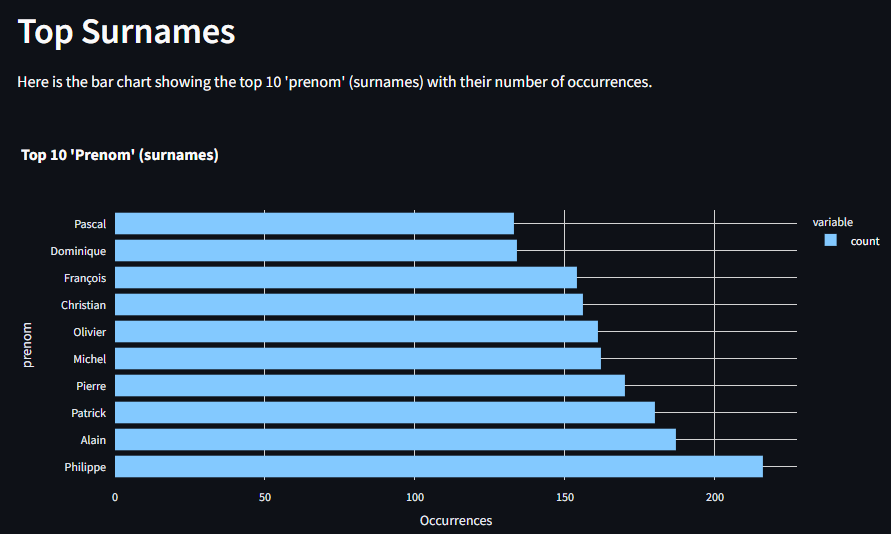
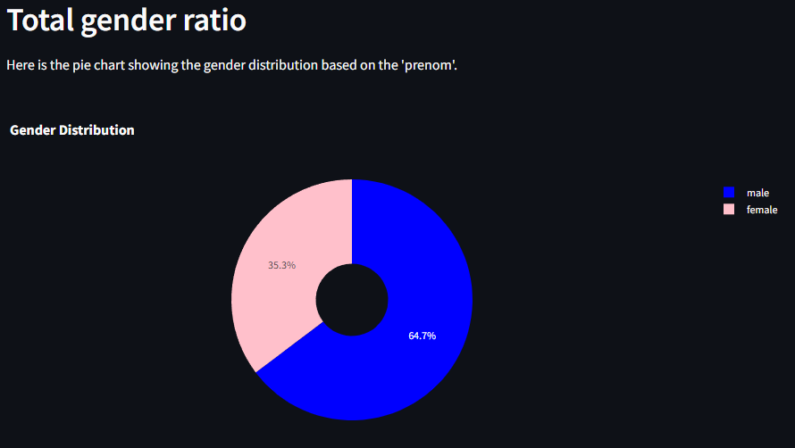
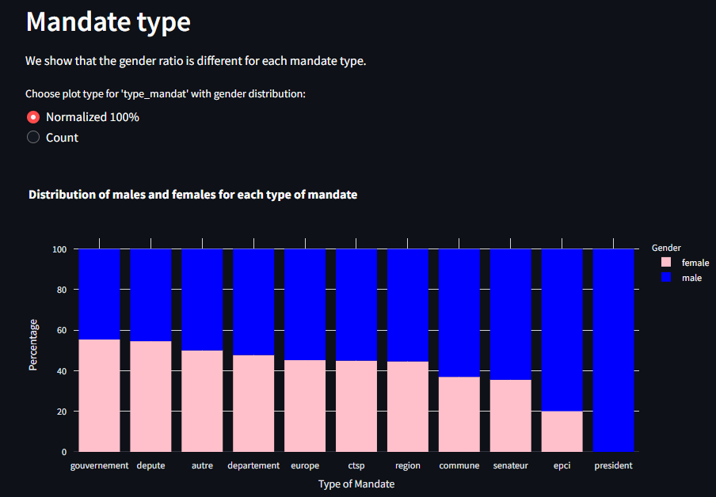
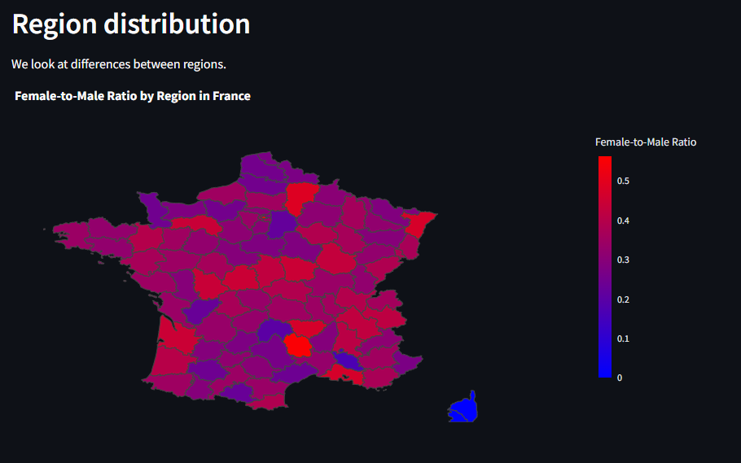

# HATVP Streamlit DataViz 📊
A streamlit test on HATVP data.

Welcome to the **HATVP Streamlit DataViz** repository! This project provides an interactive dashboard to analyze gender equality based on the HATVP declaration list archive. The dashboard is built using Streamlit and includes visualizations created with Plotly. 

## Features ✨

- **Top Surnames**: Discover the top 10 most common surnames.
- **Gender Distribution**: Visualize the gender ratio with a dynamic pie chart.
- **Mandate Types**: Compare the gender ratio across different types of mandates.
- **Regional Distribution**: Analyze the gender ratio by region using an interactive map.

## Installation 🛠️

Follow these steps to set up and run the project locally:

1. **Clone the repository**
    ```sh
    git clone https://github.com/louispaulet/hatvp_streamlit_dataviz.git
    cd hatvp_streamlit_dataviz
    ```

2. **Create and activate a virtual environment**
    ```sh
    python -m venv venv
    source venv/bin/activate  # On Windows, use `venv\Scripts\activate`
    ```

3. **Install the required dependencies**
    ```sh
    pip install -r requirements.txt
    ```

4. **Run the Streamlit app**
    ```sh
    streamlit run app.py
    ```

## Usage 🚀

Once the app is running, navigate to `http://localhost:8501` in your web browser to access the dashboard. Explore various visualizations to gain insights into gender equality in different contexts.

## Visualizations 📈

### Top Surnames


### Gender Distribution


### Mandate Types


### Regional Distribution


## Contributing 🤝

We welcome contributions! If you have ideas for improvements or new features, feel free to open an issue or submit a pull request. Please follow the guidelines outlined in `CONTRIBUTING.md`.

## License 📜

This project is licensed under the MIT License. See the `LICENSE` file for more details.

## Acknowledgements 🙏

- [Streamlit](https://streamlit.io/)
- [Plotly](https://plotly.com/)
- [HATVP Declaration List Archive](https://www.data.gouv.fr/fr/datasets/liste-des-declarations-de-situation-patrimoniale-et-dinterets-recueillies-par-la-hatvp/)

---

Thank you for checking out the HATVP Streamlit DataViz project! If you find it useful, please give it a ⭐️ on [GitHub](https://github.com/louispaulet/hatvp_streamlit_dataviz). 

Happy data exploring! 🎉